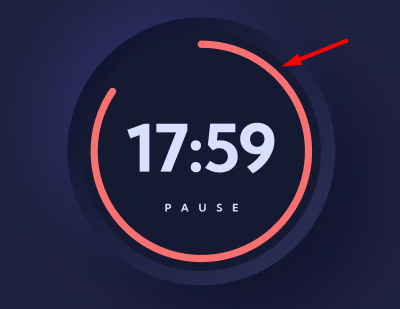

# 1-bosqichga xush kelibsiz!

Birinchi bosqich to'laqonli UI haqida bo'ladi. Berilgan figma design Tailwind CSS yordamida to'liq yozib chiqilishi kerak. Bu bosqichda hech qanday javascript kod yozishga hojat yo'q. Tailwind'ga qo'shimcha tarzda CSS/SCSS ishlatishingiz mumkun. _Verstka_ 3 kun ichida tayyor bo'lishi kerak. Boshlanishiga mobile responsive qilish haqida o'ylamang. Bu bosqichda, faqatgina Desktop designni bajarish talab etiladi sizdan.

Inobatga oling:

- Berilgan aylana shakldagi (qizil) timerni bajarish bu bosqchining talabi emas. Hozircha faqatgina umumiy aylana shakl (qora)'ni vaqt bilan birga qilib ketsangiz bo'ladi. Qizil timer esa loyihaning bonus qismiga kiritilgan:
  
