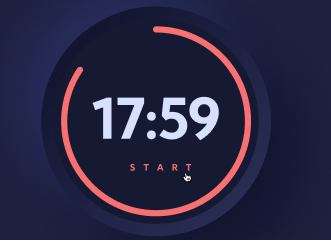
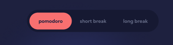
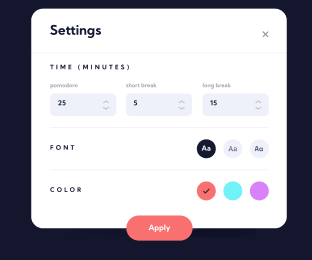

# 2-bosqichga xush kelibsiz!

Va nihoyat siz kutgan damlar yetib keldi: JavaScript 🎉

Ikkinchi bosqichda, berilgan [JavaScript](../js/script.js) faylda loyihaning asosiy logikasini yozamiz. Qiynalib, chalg'ib qolmasligingiz uchun quyidagi ketma ketlikda bu bosqichni tugatishni maslahat beraman. Har bir ketma ketlikni tugatgandan so'ng PR raise qilasiz va code review request qilasiz.

1. **start** tugmasi bosilganda _timer_ kamayishni boshlashi, va _start_ so'zi _pause_ so'ziga aylanishi kerak. Timerning boshlang'ich (default) qiymati 25:00 bo'lishi talab etiladi:
 

  

 Xuddi shunga o'xshash, **pause** tugmasi bo'silganda, timer kelgan joyida to'xtashi shart

---

2. **short break** tugmasi bosilganda, _timer_ qisqa break'ga o'tishi kerak (05:00 boshlang'ich qiymati).
   Xuddi shu o'rinda **long break** tugmasi bosilganda, katta tanaffusga, ya'ni boshlang'ich qiymat 10:00'ga aylanishi talab etiladi:

  

P.S. Qaysi tab active bo'lsa o'sha tabning background colori, berilgan qizil rangda bo'lishi talab etiladi.

---

3. _Settings_ tugmasi bosilganda, modalka ochilishi kerak va foydalanuvchi umumiy, berilgan default qiymatlarni bemalol o'zgartira olishi talab etiladi:

  

